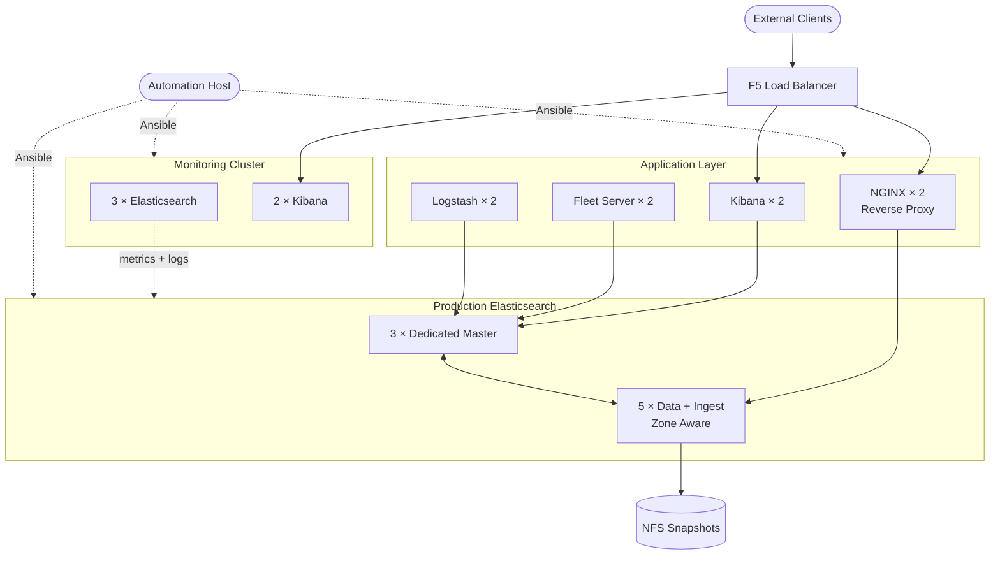

```mermaid
flowchart TB
    Client(["External Clients"])

    F5["F5 Load Balancer"]

    subgraph App["Application Layer"]
        direction LR
        NGINX["NGINX × 2\nReverse Proxy"]
        KB["Kibana × 2"]
        FS["Fleet Server × 2"]
        LS["Logstash × 2"]
    end

    subgraph Prod["Production Elasticsearch"]
        direction LR
        Masters["3 × Dedicated Master"]
        Data["5 × Data + Ingest\nZone Aware"]
    end

    subgraph Mon["Monitoring Cluster"]
        direction LR
        MonES["3 × Elasticsearch"]
        MonKB["2 × Kibana"]
    end

    NFS[("NFS Snapshots")]
    Ansible(["Automation Host"])

    Client --> F5
    F5 --> NGINX & KB & MonKB
    NGINX --> Data
    KB & FS & LS --> Masters
    Masters <--> Data
    Data --> NFS
    MonES -.->|"metrics + logs"| Prod
    Ansible -.->|"Ansible"| Prod & Mon & App
```
